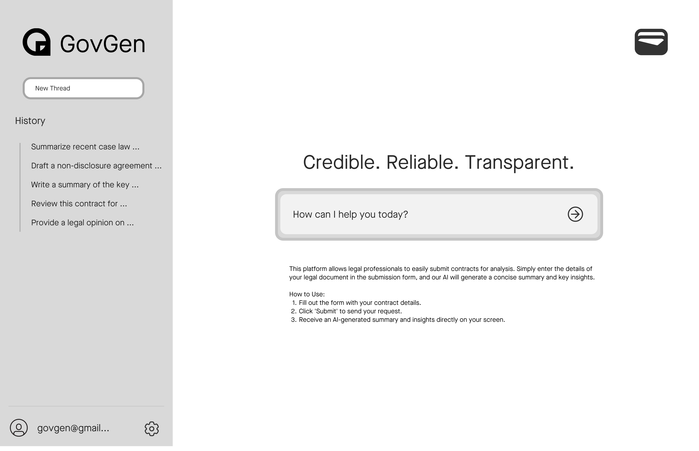
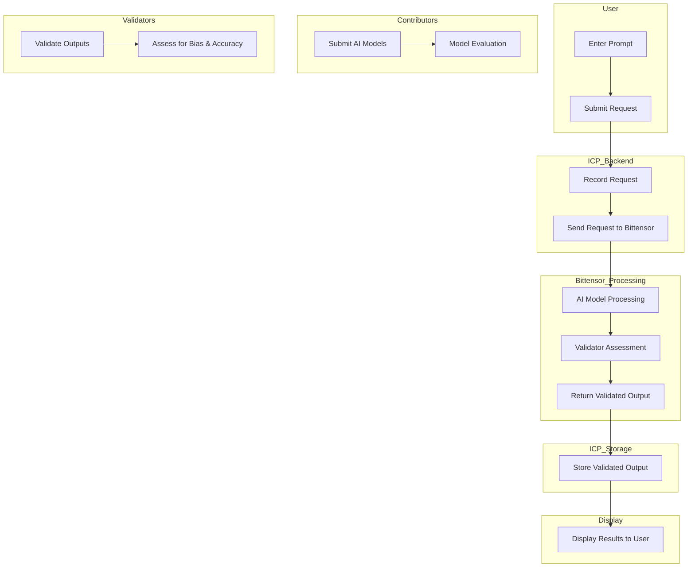

# GovGen

## Project Description
The Decentralized AI Integrity Network for Legal Tech aims to create a transparent and accountable framework for using generative AI in the legal sector. By leveraging blockchain technology, this project ensures that AI-generated outputs are reliable and adhere to legal standards. The network consists of various agents, including validators, contributors, and users, working together to maintain the integrity of AI-driven decisions.



## Key Components
- **Validators:** Nodes that assess AI-generated outputs for bias, accuracy, and compliance with legal standards.
- **Contributors:** Entities such as law firms and AI developers that provide AI models and datasets.
- **Users:** Legal professionals who request AI-driven outputs.
- **Blockchain:** The ledger that records all transactions, validations, and updates, ensuring transparency and immutability.

## How It Works
1. **Model Submission:** Contributors submit AI models for evaluation by validators.
2. **AI Output Validation:** Validators assess AI-generated outputs against legal standards.
3. **Incentivization:** Validators and contributors are rewarded with tokens for their contributions.
4. **Immutable Records:** Validated outputs and models are stored on the blockchain for auditability.

## Setup Instructions

### Prerequisites
- Node.js and npm installed
- DFINITY SDK installed
- Access to the Internet Computer and Bittensor networks

### Steps to Set Up

#### Clone the Repository
```bash
git clone https://github.com/GovGenAI/GovGen.git
cd legal_ai_project
```

#### Install Dependencies
```bash
npm install
```

#### Set Up Internet Computer Environment
Start the local Internet Computer environment using the following command:
```bash
dfx start --background
```

#### Deploy the Canister
Deploy the project canister using the following command:
```bash
dfx deploy
```

## Frontend Development
- Open index.html in your browser to access the user interface.
- Enter prompts and submit requests for processing.

## User Flow
Here's a Mermaid diagram to illustrate the user flow



